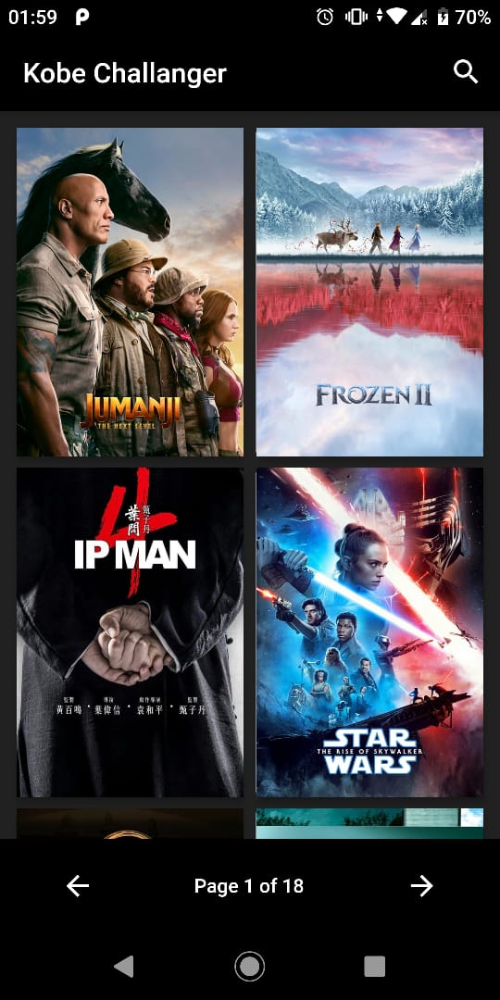

# kobe_movie_challenge

A new Flutter project.

## Getting Started

Use dependences:
   cupertino_icons: Give more Icons options
   equatable:  Being able to compare objects in Dart often involves having to override the == operator as well as hashCode.
   flutter_bloc: BlocBuilder is a Flutter widget which requires a Bloc and a builder function. BlocBuilder handles building the widget in response to new states.
   http: This package contains a set of high-level functions and classes that make it easy to consume HTTP resources.

This project is a starting point for a Flutter application.

A few resources to get you started if this is your first Flutter project:

- [Lab: Write your first Flutter app](https://flutter.dev/docs/get-started/codelab)
- [Cookbook: Useful Flutter samples](https://flutter.dev/docs/cookbook)

For help getting started with Flutter, view our
[online documentation](https://flutter.dev/docs), which offers tutorials,
samples, guidance on mobile development, and a full API reference.

 